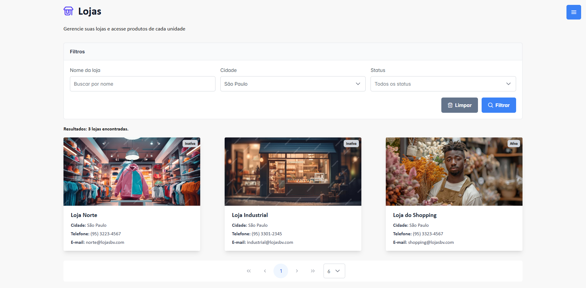
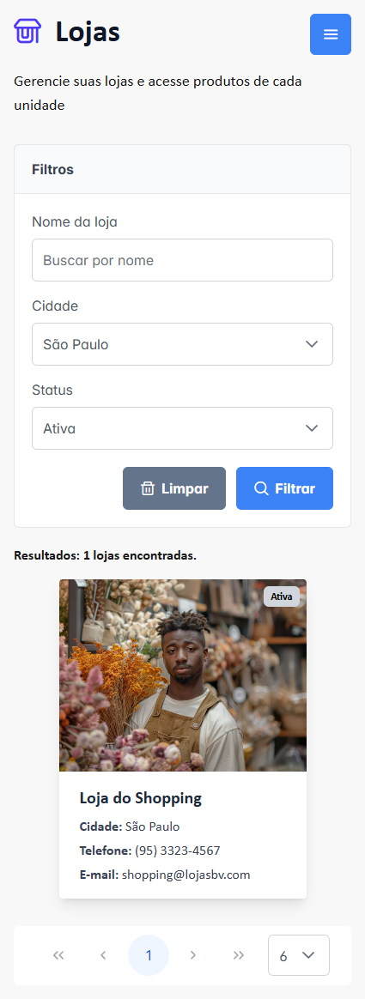
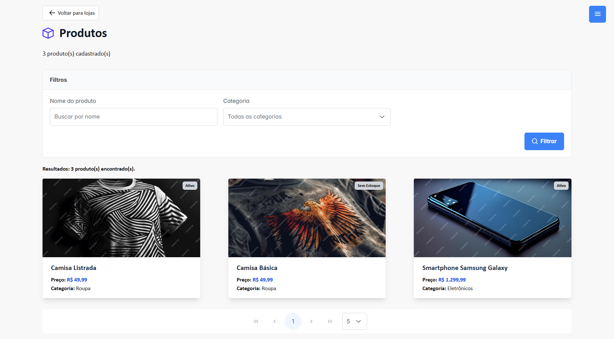
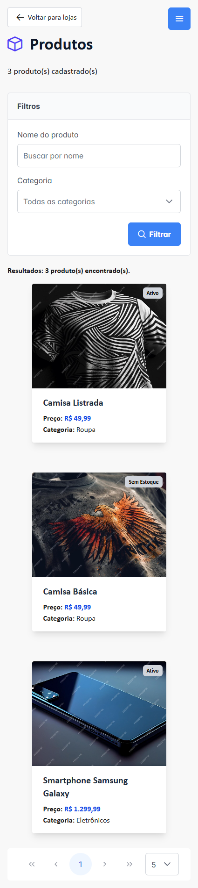
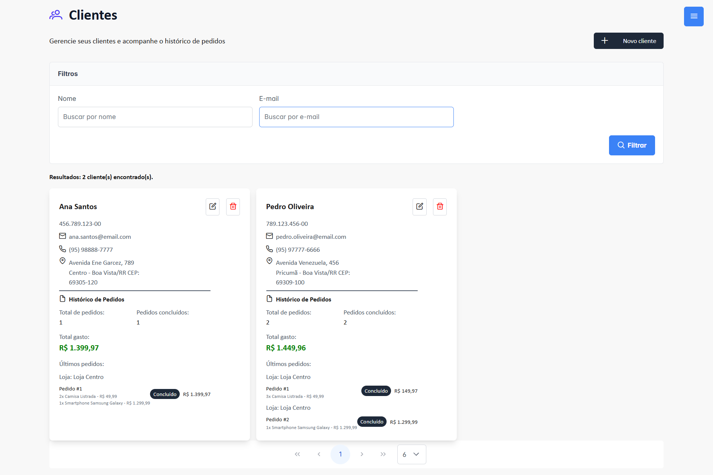
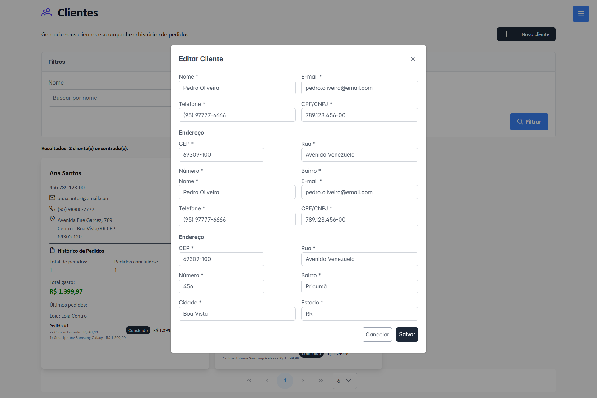
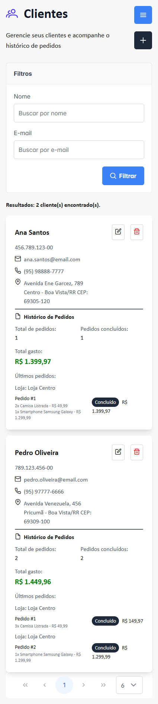

# 🏪 Sistema de Gestão de Lojas e Clientes

## 📋 Visão Geral do Projeto

Sistema web desenvolvido com **Next.js** e **TypeScript** para a gestão de **lojas, clientes e produtos**. A interface é moderna e responsiva, utilizando **PrimeReact** e **Tailwind CSS** para proporcionar uma ótima experiência ao usuário.

### ✅ Funcionalidades Principais

- 📁 Gestão completa de clientes
- 🏬 Visualização e gerenciamento de lojas
- 📦 Controle de produtos por loja
- 🔍 Sistema de filtros dinâmicos
- 📱 Interface responsiva e intuitiva

---

## 🚀 Instalação e Execução

### 🔧 Pré-requisitos

- Node.js (versão **18** ou superior)
- npm (gerenciador de pacotes)

### ⚙️ Passos para rodar o projeto

```bash
# 1. Clone o repositório
git clone https://github.com/G4briel25/desafio-web.git

# 2. Acesse a pasta do projeto
cd desafio-web

# 3. Instale as dependências
npm install

# 4. Inicie o servidor de desenvolvimento
npm run dev
```

Em outro terminal, inicie o JSON Server (API mock):

```bash
cd .\src\data\
npx json-server db.json --port 3001
```

Acesse o projeto em: [http://localhost:3000](http://localhost:3000)

Acesse o json server em: [http://localhost:3001](http://localhost:3001)

---

## 🛠️ Decisões Técnicas

### 🧱 Stack Tecnológica

- **Next.js 15.3.3** — Framework com suporte a SSR e App Router
- **TypeScript** — Tipagem estática e maior manutenibilidade
- **PrimeReact 10.9.6** — Biblioteca rica em componentes UI
- **Tailwind CSS** — Estilização com classes utilitárias
- **JSON Server** — Simulação de API REST para desenvolvimento local

### 📁 Estrutura do Projeto

```
src/
├── app/           # Rotas e páginas
├── components/    # Componentes reutilizáveis
├── services/      # Comunicação com a API
├── types/         # Tipos e interfaces do TypeScript
└── utils/         # Funções auxiliares
```

### 📐 Padrões Adotados

- 🔁 **Componentização** — Reutilização e modularidade
- 🌐 **Services** — Abstração de chamadas à API
- 🧩 **Types** — Tipagem clara e segura
- ⏳ **Lazy Loading** — Melhor performance no carregamento

---

## 📸 Screenshots

# 🏬 Gestão de Lojas



# 📦 Gestão de Produtos



# 👥 Gestão de Clientes




---

## 📦 Scripts Disponíveis

### Desenvolvimento

```bash
npm run dev       # Inicia o frontend em modo desenvolvimento

cd .\src\data\
npx json-server db.json --port 3001 # Inicia o JSON Server (API fake)
```

---

## 🌍 Ambiente Padrão

| Serviço     | URL                        |
|-------------|----------------------------|
| Frontend    | http://localhost:3000      |
| JSON Server | http://localhost:3001      |

---

## 👨‍💻 Autor

Desenvolvido por **Gabriel Jaune** para um desafio técnico.

---
